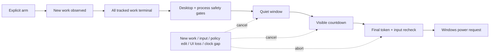

# Hermes Power Guard

[](https://github.com/Yueyue673/hermes-power-guard/actions/workflows/ci.yml)
[](https://github.com/Yueyue673/hermes-power-guard/releases)
[](LICENSE)

**Safely put Windows to sleep after Hermes finishes its observable work.**

Power Guard is a unified [Hermes Agent](https://github.com/NousResearch/hermes-agent) plugin with a Python lifecycle coordinator and a native Desktop control panel. It watches turns, background terminals, pending completion deliveries, subagents, running cron jobs, approvals, Kanban workers, and visible Desktop busy sessions. A power action is possible only after an explicitly armed, one-shot campaign passes every safety gate.

> Default action: **Sleep**. Real power actions are Windows-only and require a local Hermes Desktop-managed backend. Tests are simulation-only.

[中文说明](README.zh-CN.md)

## Why this exists

A final assistant message is not proof that a task is finished. Hermes may still have a child agent running, a terminal process alive, a completion event waiting to return to its parent, or an approval that arrived late. Power Guard treats those as state-machine inputs rather than trusting words such as “done”.

## Highlights

- **Explainable seven-gate flow** — see exactly why sleep is not eligible yet.
- **One-shot arming** — install and restart states are always disarmed.
- **Post-arm cohort** — only work observed after explicit confirmation can satisfy completion.
- **Fail-awake sensors** — a broken process/delegation/cron sensor means “unknown”, never zero.
- **Desktop cancel lease** — losing the visible control panel blocks the action.
- **Input cancellation** — any keyboard or mouse activity during countdown cancels it, even when the pre-countdown idle gate is disabled.
- **Race-resistant coordination** — SQLite generations, CAS action claims, per-window heartbeats, and adjacent token checks.
- **Crash conservatism** — restart disarms; clock jumps and resume gaps restart confirmation; temporary power plans recover conservatively.
- **Native UX** — presets, collapsible settings, recent evidence, status-bar state, snooze/resume, offline warning, and Hermes `ConfirmDialog`.

## Safety flow



Formal behavior and trust boundaries are documented in [Architecture](docs/ARCHITECTURE.md) and [Threat model](docs/THREAT-MODEL.md).

## Install

### Windows PowerShell

```powershell
git clone https://github.com/Yueyue673/hermes-power-guard.git "$env:LOCALAPPDATA\hermes\plugins\power-guard"
hermes plugins enable power-guard --no-allow-tool-override
```

Then restart Hermes Desktop once and enable **Power Guard** in **Settings → Plugins**. The Python/API half and Desktop UI half have separate enable gates.

### Installer script

Clone anywhere, then run:

```bash
python scripts/install.py
```

The script copies only plugin source files into the active `HERMES_HOME`, enables the Python plugin through the Hermes CLI, and never arms a campaign.

## Use

1. Open **自动睡眠 / Power Guard** from the Desktop sidebar.
2. Choose a preset or adjust the policy.
3. Save settings.
4. Select **Check and confirm automatic sleep**.
5. Review the exact action, terminal rule, idle threshold, quiet window, countdown, and expiry.
6. Confirm arming.

Arming does not act immediately. At least one new task must start afterward.

### Commands

```text
/power-guard status
/power-guard arm
/power-guard cancel
/power-guard snooze 15
/power-guard resume
/power-guard test 8
/power-guard display-off
```

Real power actions remain restricted to the local Desktop-managed backend. CLI commands are useful for inspection and simulation.

## What is observed

Completion cohort:

- turns in the active Hermes profile, observed after arming;
- Kanban workers observed by the plugin;
- structured completion/blocking lifecycle signals.

Global safety vetoes in the connected Desktop runtime:

- active/background terminal processes;
- pending completion deliveries;
- async subagents;
- currently running cron jobs;
- visible Desktop busy sessions/windows;
- configured protected executables;
- missing/failed required sensors.

### Scope boundary

A completely separate remote backend or detached Hermes profile that is not connected to the current Desktop cannot be proven idle. Power Guard does not claim otherwise. The current implementation uses visible Desktop busy state as a cross-session veto and the active profile as the completion cohort.

## Default policy

| Setting | Default |
|---|---:|
| Action | Sleep |
| Terminal rule | Completed or structured blocker |
| Manual interruption | Not eligible |
| Text blocker heuristic | Off |
| User idle before countdown | 5 minutes |
| Quiet window | 30 seconds |
| Visible countdown | 90 seconds |
| Arm expiry | 12 hours |
| Dry run | Off |

Sleep uses `SetSuspendState(..., ForceCritical=False, ...)`, allowing Windows or an application to veto suspension to protect unsaved work.

## Development

```bash
python -m pip install -r requirements-dev.txt
python -m unittest discover -s tests -v
python -m py_compile power_guard_core.py __init__.py dashboard/plugin_api.py
node --check desktop/plugin.js
```

Inside a Hermes installation, also run:

```bash
hermes plugins doctor . --ci
```

The test suite never invokes a real power action. See [CONTRIBUTING.md](CONTRIBUTING.md).

## Current verification

Version `0.3.0` was locally verified with:

- 40 unit/API/concurrency/safety tests;
- Python compile checks;
- Desktop ESM syntax check;
- Hermes Plugin Doctor (12 lifecycle hooks);
- a real isolated `hermes serve` API path;
- simulated countdown result: `SIMULATED sleep`.

No real sleep, shutdown, hibernate, lock, or display-off action is performed by the automated test suite.

## License

MIT — see [LICENSE](LICENSE).
