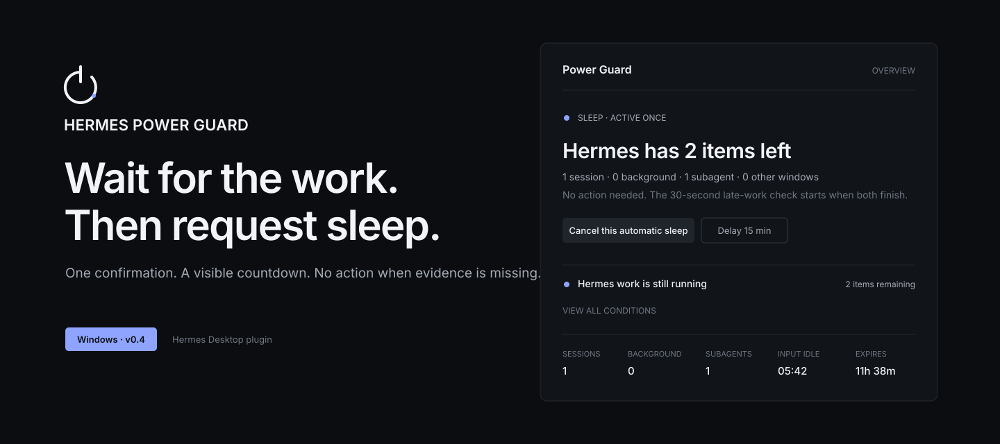
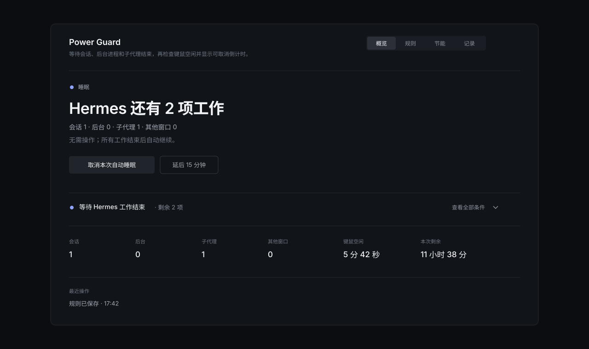

# Hermes Power Guard



**等 Hermes 真正没有可观察的工作后，再让 Windows 睡眠。模型回复“完成了”不算证据。**

每次使用都要确认一次。Power Guard 只跟踪确认后开始的任务，直接告诉你什么仍在阻止睡眠，并在请求 Windows 睡眠前显示可取消倒计时。

[下载最新版](https://github.com/Yueyue673/hermes-power-guard/releases/latest) · [安装](#安装) · [判断过程](#怎样判断) · [排障](docs/TROUBLESHOOTING.md) · [English](README.md)



## 安装

Windows PowerShell：

```powershell
git clone https://github.com/Yueyue673/hermes-power-guard.git "$env:LOCALAPPDATA\hermes\plugins\power-guard"
hermes plugins enable power-guard --no-allow-tool-override
```

重启一次 Hermes Desktop，然后在 **设置 → 插件** 中启用 **Power Guard**。Python 插件和 Desktop UI 是两个独立开关，必须同时开启。安装不会启用自动睡眠。

已经克隆到其他目录？运行 `python scripts/install.py`。

## 怎样判断

### 等待工作，不相信措辞

聊天里出现最终回复还不够。活动会话、后台终端、待回灌结果、子代理、正在运行的 Cron、其他忙碌窗口和受保护程序都可以让电脑继续保持唤醒。

默认情况下，确认时已经运行的长期终端进程会成为本次基线；确认后新启动的进程仍然必须结束。Cron、子代理和待回灌结果无论何时开始都会继续阻止，因为稳定 ID 无法证明后来出现的是同一轮旧工作。需要时仍可选择“等待所有 Hermes 后台进程”的严格规则。

### 证据缺失时保持唤醒

读不到必要传感器、任务结果、键鼠空闲时间或 Desktop 连接时，Power Guard 不会继续接近睡眠。重启也会取消本次规则。

### 你回来时自动取消

倒计时期间出现键鼠输入会立即取消。新 Hermes 任务、规则变化、控制面板离线、时钟跳变或系统恢复也会重新开始检查。

## 睡眠路径

```text
确认本次自动睡眠
  → 观察一个新 Hermes 任务
  → 等所有被跟踪的工作结束
  → 检查 Desktop、键鼠和受保护程序
  → 继续观察一小段时间，等待迟到任务
  → 显示可取消倒计时
  → 最后再检查一次任务和键鼠
  → 向 Windows 请求一次睡眠
```

睡眠请求不使用强制模式。Windows 或应用可以为了保护未保存工作而拒绝。Power Guard 会显示失败，并且不会自动重试。

## 使用

从 Desktop 侧栏打开 **Power Guard**。

- **概览**：当前结论、证据、下一事件和唯一主操作。
- **规则**：什么算结束，以及确认需要多久。
- **节能**：Hermes 工作期间的显示器、优先级和电源计划。
- **记录**：任务结果和状态变化。

保存规则后，点击 **启用本次自动睡眠**。确认前已经开始的任务不会单独触发睡眠。

检查和模拟命令：

```text
/power-guard status
/power-guard cancel
/power-guard snooze 15
/power-guard resume
/power-guard test 8
```

## 兼容性与边界

| | 边界 |
|---|---|
| 真实电源动作 | Windows；本机 Hermes Desktop 管理的后端 |
| 默认动作 | 非强制睡眠 |
| 可以完成本次规则的工作 | 当前 profile 中、确认后观察到的任务 |
| 可以阻止执行的工作 | 当前 Desktop 会话、后台进程、子代理、运行中的 Cron、受保护程序、未知传感器 |
| 自动测试 | 只模拟，不执行真实电源动作 |
| 界面语言 | v0.4 为中文；仓库同时提供英文文档 |

完全独立、未连接到当前 Desktop 的远程 backend 或 profile 无法被证明为空闲；Power Guard 不会假装覆盖它。

## 项目文档

- [产品设计](DESIGN.md)
- [成熟项目对标](docs/BENCHMARKS.md)
- [状态矩阵](docs/STATE-MATRIX.md)
- [产品语言](docs/PRODUCT-LANGUAGE.md)
- [架构](docs/ARCHITECTURE.md)
- [威胁模型](docs/THREAT-MODEL.md)
- [排障](docs/TROUBLESHOOTING.md)
- [兼容性](docs/COMPATIBILITY.md)
- [安全报告](SECURITY.md)
- [参与贡献](CONTRIBUTING.md)
- [更新记录](CHANGELOG.md)

MIT，见 [LICENSE](LICENSE)。
